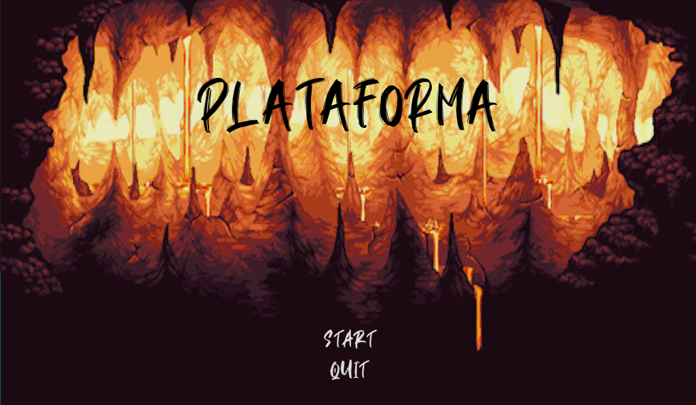
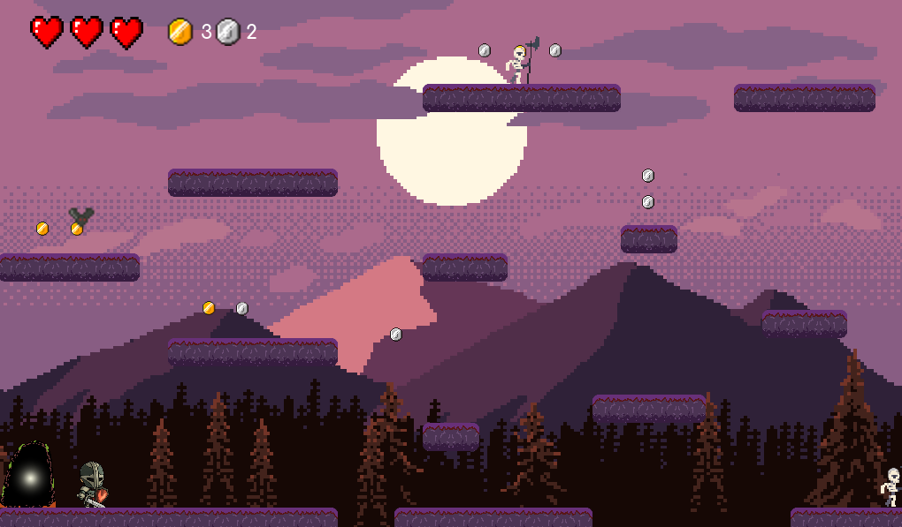

<h1 align="center">

 
Plataforma
</h1>

# 📋 Índice

- [Telas](#-Telas)
- [Sobre o projeto](#-Sobre-o-projeto)

## 🎨 Telas

 
 

## 📃 Sobre o projeto

Projeto desenvolvido para máteria de Algoritimos de programação, foi realizada uma apresentação do jogo para um escola de Curitiba - PR, desenvolvido utilizando Godot Engine.
